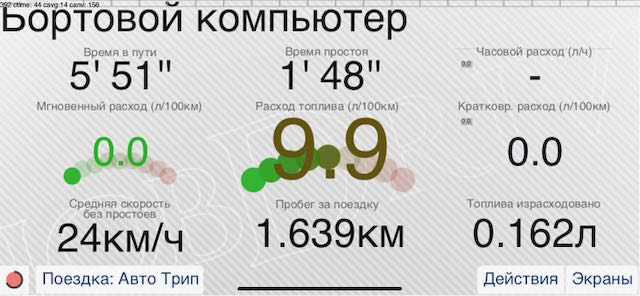

# hobdrive-dashkits
Standard and community supported dash panels for hobdrive

Refer [LAYOUT_SPEC.md](LAYOUT_SPEC.md) for detailed description of hobDrive layout language.

If you want to create your own dashes and screens - consider cloning this template repository: [template-dashkits](https://github.com/hobdrive/template-dashkits)

