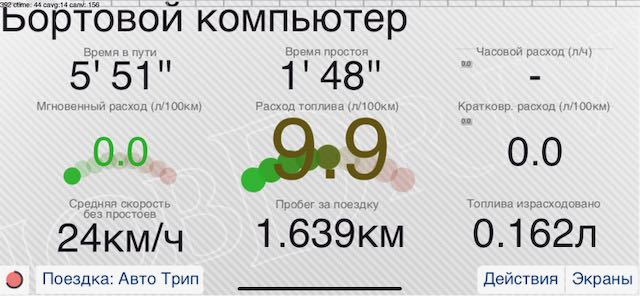
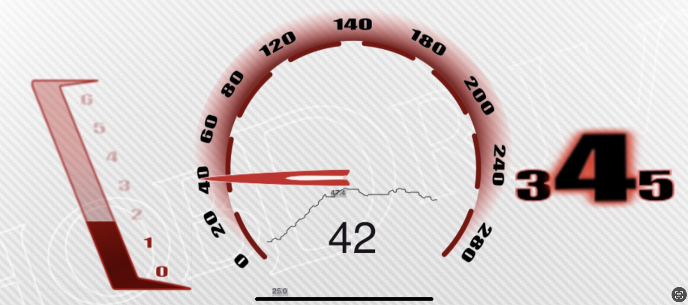

# hobdrive-dashkits
Paneles de instrumentos estándar y soportados por la comunidad para hobdrive

Translations:
[English](README.md) |
[Russian](README_RU.md) |
[Spanish](README_ES.md) |

Consulte [LAYOUT_SPEC.md](https://github.com/hobdrive/hobdrive-docs/blob/main/en/LAYOUT_SPEC.md) para una descripción detallada del lenguaje de diseño de hobDrive.

Si desea crear sus propios paneles y pantallas, considere clonar este repositorio de plantillas: [template-dashkits](https://github.com/hobdrive/template-dashkits)

