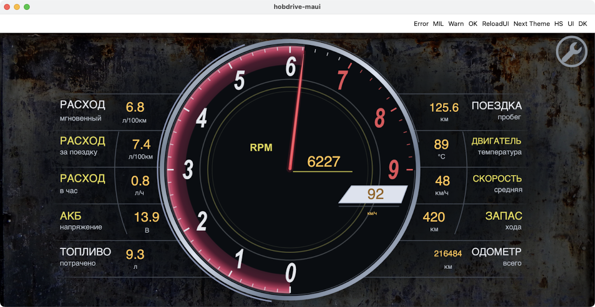
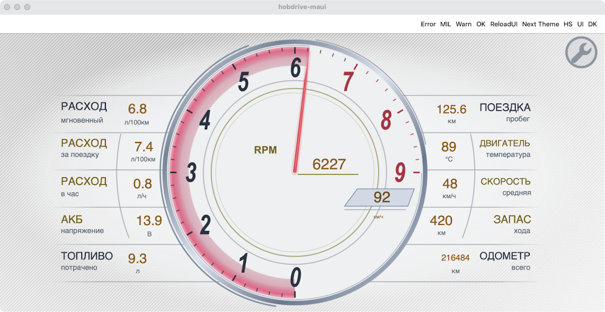

# sup4

Ландшафтная приборная панель по фотографии: центральный тахометр 0–9000 об/мин,
малиновая дуга до положения стрелки, серебристый обод, окно скорости внутри круга
и пять строк показаний с каждой стороны. Средние три значения повторяют дугу
прибора, а тонкие боковые дуги отделяют их от подписей. Светлая и тёмная темы
используют отдельные SVG. Пропорции композиции сохраняются на широком экране.
Фон приложения виден вокруг приборов: мягкая овальная подложка затемняет его
в тёмной теме и осветляет в светлой, полностью уходя в прозрачность к краям.
Боковые линии также плавно исчезают на концах; прямоугольной заливки панели нет.
В портрете тот же тахометр занимает почти всю ширину. Пять показателей бывшей
левой колонки стоят компактной строкой сверху, пять правой — снизу. Меньший размер
и приглушённый цвет показаний сохраняют акцент на шкале и малиновой дуге.
Обе ориентации проверены в Mac Catalyst Debug. Первые превью ниже — ландшафт;
портретные кадры приведены отдельно.


Показания на превью — тестовые. Подписи приборов повторяют оригинал; значения
используют выбранную в приложении систему единиц, единица скорости локализуется.
`IAT` привязан к `IntakeAirTemp`, `OIL T` — к `EngineOilTemp`.
`EthanolContent` и `OilPressure` требуют соответствующих датчиков в профиле ЭБУ;
при отсутствии датчика отображается прочерк. Остальные привязки: `FuelPressure`,
`BoostPressure`, `ControlModuleVoltage`, `Lambda`, `CoolantTemp`, `Odometer`, `RPM`, `Speed`.

## Гоночные и повседневные показатели

В настройках экранов выберите **sup4 → Гоночные показатели**. Переключатель включён
по умолчанию: это оригинальный набор с фотографии. Выключите его и закройте
настройки, чтобы показать повседневные данные. Положение чисел по дуге сохраняется;
подписи и единицы переключаются вместе с датчиками. Выбор общий для обеих ориентаций.

| Оригинальная строка | В обычном режиме | Датчик |
| --- | --- | --- |
| Fuel pres. | Мгновенный расход | `FuelEconomy_instant` |
| IAT | Средний расход за поездку | `FuelEconomy_trip` |
| BOOST | Часовой расход | `FuelPerHour` |
| BATTERY | Напряжение | `ControlModuleVoltage` |
| Lambda | Израсходованное топливо | `FuelConsumed` |
| Ethanol | Пробег поездки | `DistanceRun` |
| WATER | Температура охлаждающей жидкости | `CoolantTemp` |
| OIL T | Средняя скорость за поездку | `Speed_average` |
| OIL P | Запас хода | `DistanceToEmpty` |
| ODO | Одометр | `Odometer` |

Используются штатные расчётные датчики hobDrive. Для расхода нужен настроенный
источник расхода топлива, для запаса хода — данные об остатке топлива и расходе.
Если нужного датчика или достоверного значения нет, остаётся прочерк.
Единицы следуют настройкам приложения. Короткие подписи доступны на русском
и английском; остальные языки используют английские подписи.




Обычный режим проверен в Mac Catalyst Debug при размере окна 1200 × 620:
обе темы, русские и английские подписи, метрические и американские единицы,
прочерки при недоступных температуре и напряжении. Переключатель проверен через
настройки экрана, включая сохранение выбора после перезапуска. Исходный набор
проверен без сохранённой настройки — он включается по умолчанию.
На новых превью заданы тестовые 6,8 и 7,4 л/100 км, 0,8 л/ч, 9,3 л,
125,6 км за поездку, средняя скорость 48 км/ч и запас хода 420 км.

## Портрет

| Набор показателей | Тёмная тема | Светлая тема |
| --- | --- | --- |
| Гоночный | [Превью](preview-portrait-dark.png) | [Превью](preview-portrait-light.png) |
| Повседневный | [Превью](preview-portrait-daily-dark.png) | [Превью](preview-portrait-daily-light.png) |

Проверено в реальном окне Catalyst 430 × 800 точек (кадры 860 × 1600): обе темы
и оба набора показателей, русские и английские подписи, метрические и американские
единицы. Проверены прочерки при недоступных напряжении и температуре, появление
показаний вместе с единицами после получения данных, отрицательная температура,
шестизначный одометр, RPM 0 и 9000, ограничение стрелки и подсветки при −500 и 10000.
Другие размеры портретного окна в этом прогоне не снимались: автоматическое
изменение размера окна через macOS Accessibility было недоступно. Расчёт вписывания
дополнительно проверен 11 тестами, включая узкую, планшетную и широкую области.

Точное сохранение круга использует новый атрибут движка `union aspect-ratio`:
нужна сборка приложения с его поддержкой. Старые сборки игнорируют этот атрибут
и используют прежнее приближённое вписывание, которое в портрете может сжать круг.

Для редактирования через Mac Catalyst можно использовать ссылку
`Documents/override-sup4` в контейнере `com.hobdrive.maui` на этот каталог.
После правки из репозитория `hobd`:

```sh
.artifacts/tools/maccatalyst-window --action ForceReloadUI
# После завершения перезагрузки:
.artifacts/tools/maccatalyst-window --action 'go(sup4)'
./scripts/maccatalyst-ui.sh screenshot
```

Превью проверены в Mac Catalyst Debug: обе темы, обычный и широкий ландшафт,
заполнение шкалы и ограничение стрелки при выходе за диапазон. Исходные настройки
профиля и пользовательский симулятор восстанавливаются после визуальной проверки.
Кнопки Debug и значок обслуживания на скриншотах принадлежат приложению.

## Artwork / maintenance

The landscape composition is designed in a 1000 × 560 coordinate system, with a
560 × 560 tachometer in the middle. The fit accounts for the section renderer’s
2% right margin, keeping the circular masks aligned as the window changes shape.
The dial's `landscape-*.svg` assets are shared by both orientations.
Instrument SVG logical dimensions are half the viewBox size; the soft backdrop
uses 250 × 140 logical pixels for a 1000 × 560 viewBox to limit memory use with
MAUI's 4× SVG rasterization. Static
lettering is outlined, so its weight and slant do not depend on installed fonts.

The backdrop is an elliptical radial gradient with zero alpha at every edge.
The panel SVG contains no opaque rectangle, and its horizontal dividers fade at
both ends. This lets the app's selected wallpaper continue around the instrument
without a rectangular boundary. Keep the dial face and arc masks opaque together;
fading the whole instrument would expose the wallpaper through its moving masks.
Previews use the existing dark-rust-metal and Light-Carbon wallpapers, respectively.

RPM maps to `180 + clamp(RPM, 0, 9000) × 0.03` degrees: zero points down,
6000 points up, and 9000 points right. Two bounded masks reveal the illuminated
arc without wrapping back over the beginning of the scale. The zero-padding
wrapper between each rotating mask and its crop is intentional: it applies the
rotation before `CropDecorator` draws the target into its offscreen buffer.

The middle three readings on each side follow a radius-310 circle around the
instrument center. The radius-360 separators sit between the labels and values;
BATTERY lettering is condensed to leave a clear gap. Values overlay the full
composition so they can follow the curve beyond the rectangular side columns.

Digital values remain live sensor widgets. Missing sensors use `type="text"` to
keep the compact placeholder, and `units="none"` suppresses inline units in the
landscape racing rows. The separate speed-unit item uses `text-values="0:"` and
`units="aside"` to retain the application's localized unit label.

`Layout_Sup4_Racing` is a section-local `<config type="bool" default="true">`.
Its complementary `if` conditions select the panel artwork and the complete side
reading group together. Both orientation sections declare the same property ID;
rotating the device preserves the selected readings. Everyday labels are live text widgets using `t()` with
`lang/en/sup4.properties` and `lang/ru/sup4.properties`; each value has a separate
localized unit widget. DateTime drives only the static translated labels and does
not add OBD polling. Synthetic readings used during visual QA are not shipped.
Unit widgets use `text-values="0:"`, `units="aside"` and a dynamic text evaluator
that returns `Sensor_Text` only for a valid sensor. This keeps the unit and its
reading on the same update path; a visibility decorator could leave the unit hidden
after its first invalid frame. Static portrait labels refresh every second.

Portrait uses a uniformly fitted 560 × 800 canvas. The original 560 × 560 dial
union sits at y=120, with its masks, needle, digital RPM and speed-unit widget
unchanged. The ten readings occupy two rows of five outside the dial, with
separate boxes for labels, values and localized units. Portrait racing labels
retain the reference's short English names; everyday labels reuse the translations
above. The `portrait-backdrop-*` SVGs feather the backing beneath the readings;
`portrait-dividers-*` add only two faint horizontal rules, with no card borders.
The inner `union aspect-ratio="0.7"` fits to the actual container after application
chrome. `LayoutHeight` alone includes the portrait service area and produced a
visibly flattened dial. The outer expression-based grid remains a fallback for
older runtimes; keep the entire dial and both reading banks inside the fitted union.
