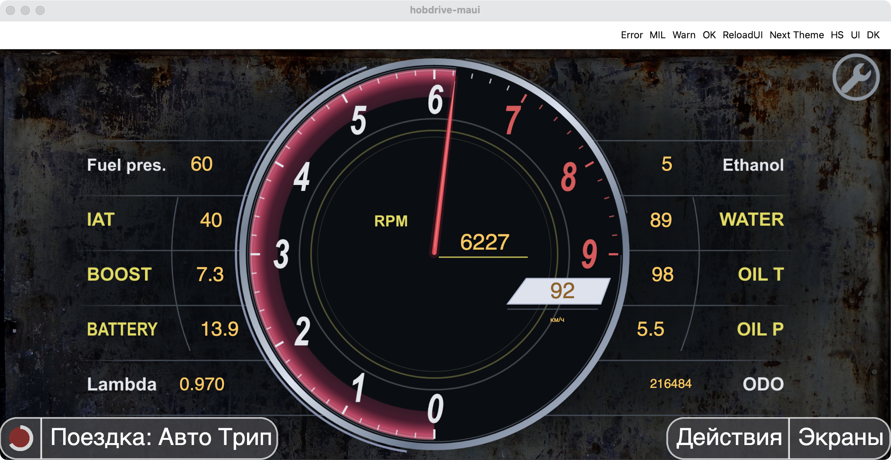
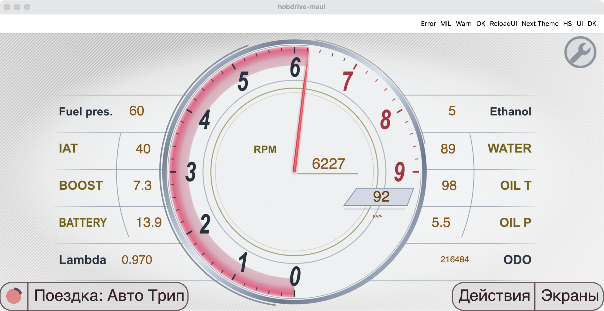

# sup4

Ландшафтная приборная панель по фотографии: центральный тахометр 0–9000 об/мин,
малиновая дуга до положения стрелки, серебристый обод, окно скорости внутри круга
и пять строк показаний с каждой стороны. Средние три значения повторяют дугу
прибора, а тонкие боковые дуги отделяют их от подписей. Светлая и тёмная темы
используют отдельные SVG. Пропорции композиции сохраняются на широком экране.
Фон приложения виден вокруг приборов: мягкая овальная подложка затемняет его
в тёмной теме и осветляет в светлой, полностью уходя в прозрачность к краям.
Боковые линии также плавно исчезают на концах; прямоугольной заливки панели нет.
Старый портретный вариант оставлен для отдельной доработки.




Показания на превью — тестовые. Подписи приборов повторяют оригинал; значения
используют выбранную в приложении систему единиц, единица скорости локализуется.
`IAT` привязан к `IntakeAirTemp`, `OIL T` — к `EngineOilTemp`.
`EthanolContent` и `OilPressure` требуют соответствующих датчиков в профиле ЭБУ;
при отсутствии датчика отображается прочерк. Остальные привязки: `FuelPressure`,
`BoostPressure`, `ControlModuleVoltage`, `Lambda`, `CoolantTemp`, `Odometer`, `RPM`, `Speed`.

Для редактирования через Mac Catalyst можно использовать ссылку
`Documents/override-sup4` в контейнере `com.hobdrive.maui` на этот каталог.
После правки из репозитория `hobd`:

```sh
.artifacts/tools/maccatalyst-window --action ForceReloadUI
# После завершения перезагрузки:
.artifacts/tools/maccatalyst-window --action 'go(sup4)'
./scripts/maccatalyst-ui.sh screenshot
```

Превью проверены в Mac Catalyst Debug: обе темы, обычный и широкий ландшафт,
заполнение шкалы и ограничение стрелки при выходе за диапазон. Исходные настройки
профиля и пользовательский симулятор восстанавливаются после визуальной проверки.
Кнопки Debug и значок обслуживания на скриншотах принадлежат приложению.

## Artwork / maintenance

The landscape composition is designed in a 1000 × 560 coordinate system, with a
560 × 560 tachometer in the middle. The fit accounts for the section renderer’s
2% right margin, keeping the circular masks aligned as the window changes shape.
The `landscape-*.svg` assets are independent of the retained portrait artwork.
Instrument SVG logical dimensions are half the viewBox size; the soft backdrop
uses 250 × 140 logical pixels for a 1000 × 560 viewBox to limit memory use with
MAUI's 4× SVG rasterization. Static
lettering is outlined, so its weight and slant do not depend on installed fonts.

The backdrop is an elliptical radial gradient with zero alpha at every edge.
The panel SVG contains no opaque rectangle, and its horizontal dividers fade at
both ends. This lets the app's selected wallpaper continue around the instrument
without a rectangular boundary. Keep the dial face and arc masks opaque together;
fading the whole instrument would expose the wallpaper through its moving masks.
Previews use the existing dark-rust-metal and Light-Carbon wallpapers, respectively.

RPM maps to `180 + clamp(RPM, 0, 9000) × 0.03` degrees: zero points down,
6000 points up, and 9000 points right. Two bounded masks reveal the illuminated
arc without wrapping back over the beginning of the scale. The zero-padding
wrapper between each rotating mask and its crop is intentional: it applies the
rotation before `CropDecorator` draws the target into its offscreen buffer.

The middle three readings on each side follow a radius-310 circle around the
instrument center. The radius-360 separators sit between the labels and values;
BATTERY lettering is condensed to leave a clear gap. Values overlay the full
composition so they can follow the curve beyond the rectangular side columns.

Digital values remain live sensor widgets. Missing sensors use `type="text"` to
keep the compact placeholder, and `units="none"` suppresses inline units in the
side rows. The separate speed-unit item uses `text-values="0:"` and
`units="aside"` to retain the application's localized unit label.
